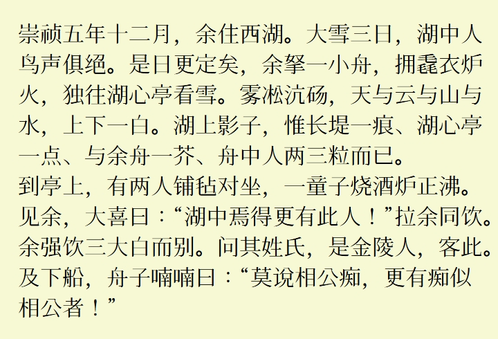

[简体中文](../../#LanternMing-上元明朝) **繁體中文**
# LanternMing 上元明朝
一款涵蓋目前 Unicode （Unicode 15.1）收錄的所有漢字的舊字形風格中文字型，基於醍醐書體與花園明朝製作。

## 說明
* 完整涵蓋了 Unicode 15.1 中的所有漢字。
* 中文優先使用醍醐明朝的舊字形字圖。
* 繼承了花園明朝豐富的非中文字元。
* 加入了少量 OpenType 功能。
* 與醍醐書體/花園明朝相同，本字型使用了 2 個字型檔。

## 預覽
  
  

## 漢字部分統計
 | 區塊名稱 | 上元明朝A | 上元明朝B | 上元明朝總數 | Unicode 收錄總數 |
 | ---- | ---- | ---- | ---- | ---- |
 | 康熙字典部首 | 214 | 0 | 214 | 214 |
 | 中日韓漢字部首補充 | 115 | 0 | 115 | 115 |
 | 〇 | 1 | 0 | 1 | 1 |
 | 中日韓統一表意文字 | 20992 | 1 | 20992 | 20992 |
 | 中日韓統一表意文字擴充-A | 6592 | 0 | 6592 | 6592 |
 | 中日韓統一表意文字擴充-B | 0 | 42720 | 42720 | 42720 |
 | 中日韓統一表意文字擴充-C | 4154 | 0 | 4154 | 4154 |
 | 中日韓統一表意文字擴充-D | 222 | 0 | 222 | 222 |
 | 中日韓統一表意文字擴充-E | 5762 | 0 | 5762 | 5762 |
 | 中日韓統一表意文字擴充-F | 7473 | 0 | 7473 | 7473 |
 | 中日韓統一表意文字擴充-G | 4939 | 0 | 4939 | 4939 |
 | 中日韓統一表意文字擴充-H | 4192 | 0 | 4192 | 4192 |
 | 中日韓統一表意文字擴充-I | 0 | 622 | 622 | 622 |
 | 中日韓兼容表意文字 | 472 | 0 | 472 | 472 |
 | 中日韓兼容表意文字補充 | 542 | 0 | 542 | 542 |
 | 合計 | 55670 | 43343 | 99012 | 99012 |

## 下載字型
可從本站 [Releases](../../releases) 頁面下載字型。

## 授權
遵循[GlyphWiki:著作權與許可協議](http://zht.glyphwiki.org/wiki/GlyphWiki:著作權與許可協議)。

## 相關鏈接
* [字形維基(GlyphWiki)](https://glyphwiki.org/)
* [醍醐書體A](https://glyphwiki.org/wiki/Group:nobu_醍醐書體A)
* [醍醐書體B](https://glyphwiki.org/wiki/Group:nobu_醍醐書體B)
* [花園明朝A](https://glyphwiki.org/wiki/Group:kamichi_hma)
* [花園明朝B](https://glyphwiki.org/wiki/Group:kamichi_hmb)
* [AppendingToHanaMin](https://glyphwiki.org/wiki/Group:cutra_AppendingToHanaMin)
* [FontForge](https://github.com/fontforge/fontforge)
