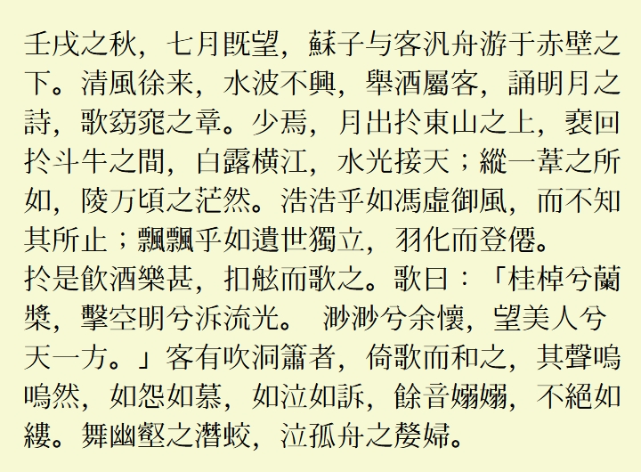

[简体中文](../../#LanternMing-上元明朝) **繁體中文**
# LanternMing 上元明朝
一款涵蓋目前 Unicode （Unicode 15.0）收錄的所有漢字的舊字形風格中文字型，基於醍醐書體與花園明朝製作。

## 說明
* 完整涵蓋了 Unicode 15.0 九萬七千多漢字，以及新增中日韓統一表意文字擴展 I 區漢字。
* 中文優先使用醍醐明朝的舊字形字圖。
* 繼承了花園明朝豐富的非中文字元。
* 加入了少量 OpenType 功能。
* 與醍醐書體/花園明朝相同，本字型使用了 2 個字型檔。

## 預覽
  
  
## 下載字型
可從本站 [Releases](../../releases) 頁面下載字型。
## 授權
遵循[GlyphWiki:著作權與許可協議](http://zht.glyphwiki.org/wiki/GlyphWiki:著作權與許可協議)。
## 相關鏈接
* [字形維基(GlyphWiki)](https://glyphwiki.org/)
* [醍醐書體A](https://glyphwiki.org/wiki/Group:nobu_醍醐書體A)
* [醍醐書體B](https://glyphwiki.org/wiki/Group:nobu_醍醐書體B)
* [花園明朝A](https://glyphwiki.org/wiki/Group:kamichi_hma)
* [花園明朝B](https://glyphwiki.org/wiki/Group:kamichi_hmb)
* [AppendingToHanaMin](https://glyphwiki.org/wiki/Group:cutra_AppendingToHanaMin)
* [FontForge](https://github.com/fontforge/fontforge)
