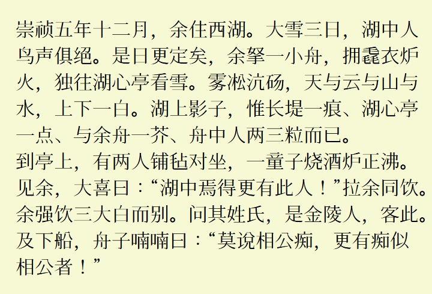
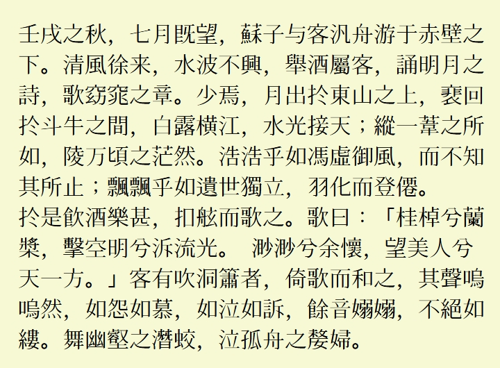

**简体中文** [繁體中文](README-TC.md#LanternMing-上元明朝)
# LanternMing 上元明朝
一款涵盖目前 Unicode （Unicode 15.1）收录的所有汉字的旧字形风格中文字体，基于醍醐书体与花园明朝制作。

## 说明
* 完整涵盖了 Unicode 15.1 中的所有汉字。
* 中文优先使用醍醐明朝的旧字形字图。
* 继承了花园明朝丰富的非中文字符。
* 加入了少量 OpenType 功能。
* 与醍醐书体/花园明朝相同，本字体使用了 2 个字体文件。

## 预览
  
  

## 汉字部分统计
 | 区块名称 | 上元明朝A | 上元明朝B | 上元明朝总数 | Unicode 收录总数 |
 | ---- | ---- | ---- | ---- | ---- |
 | 康熙字典部首 | 214 | 0 | 214 | 214 |
 | 中日韩汉字部首补充 | 115 | 0 | 115 | 115 |
 | 〇 | 1 | 0 | 1 | 1 |
 | 中日韩统一表意文字 | 20992 | 1 | 20992 | 20992 |
 | 中日韩统一表意文字扩展-A | 6592 | 0 | 6592 | 6592 |
 | 中日韩统一表意文字扩展-B | 0 | 42720 | 42720 | 42720 |
 | 中日韩统一表意文字扩展-C | 4154 | 0 | 4154 | 4154 |
 | 中日韩统一表意文字扩展-D | 222 | 0 | 222 | 222 |
 | 中日韩统一表意文字扩展-E | 5762 | 0 | 5762 | 5762 |
 | 中日韩统一表意文字扩展-F | 7473 | 0 | 7473 | 7473 |
 | 中日韩统一表意文字扩展-G | 4939 | 0 | 4939 | 4939 |
 | 中日韩统一表意文字扩展-H | 4192 | 0 | 4192 | 4192 |
 | 中日韩统一表意文字扩展-I | 0 | 622 | 622 | 622 |
 | 中日韩兼容表意文字 | 472 | 0 | 472 | 472 |
 | 中日韩兼容表意文字补充 | 542 | 0 | 542 | 542 |
 | 合计 | 55670 | 43343 | 99012 | 99012 |

## 下载字体
可从本站 [Releases](../../releases) 页面下载字体。

## 授权
遵循[GlyphWiki:著作权与许可协议](http://zhs.glyphwiki.org/wiki/GlyphWiki:著作权与许可协议)。

## 相关链接
* [字形维基(GlyphWiki)](https://glyphwiki.org/)
* [醍醐书体A](https://glyphwiki.org/wiki/Group:nobu_醍醐書體A)
* [醍醐书体B](https://glyphwiki.org/wiki/Group:nobu_醍醐書體B)
* [花园明朝A](https://glyphwiki.org/wiki/Group:kamichi_hma)
* [花园明朝B](https://glyphwiki.org/wiki/Group:kamichi_hmb)
* [AppendingToHanaMin](https://glyphwiki.org/wiki/Group:cutra_AppendingToHanaMin)
* [FontForge](https://github.com/fontforge/fontforge)
